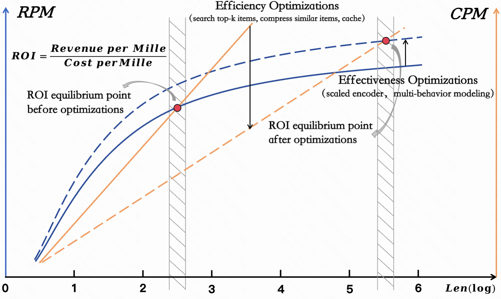

# A Survey of User Lifelong Behavior Modeling: Perspectives on Efficiency and Effectiveness

## Overview
This is the official repository of the paper "A Survey of User Lifelong Behavior Modeling: Perspectives on Efficiency and Effectiveness"

This survey provides an in-depth examination of existing User Lifelong Behavior Modeling (ULBM) methods from an industrial perspective, with a particular focus on their performance under the efficiency–effectiveness balance, aiming to sustain a stable return on investment (ROI) as user lifelong behavior sequences continue to grow.

We will continue to track and summarize emerging ULBM research, with particular attention to approaches that have been validated in real-world industrial settings, in order to facilitate the continued advancement of this field.

## Table of Contents
- [Introduction](#introduction)
- [Survey Scope](#survey-scope)
- [Efficiency-Effectiveness Balance](#efficiency-effectiveness-balance)
  - [Efficiency Optimizations](#efficiency-optimizations)
    - [Algorithmic](#algorithmic)
    - [Infrastructure](#infrastructure)
  - [Effectiveness Optimizations](#effectiveness-optimizations)
    - [Advancing Interaction Modeling Capability](#advancing-interaction-modeling-capability)
    - [Fine-Grained User Interest Understanding](#fine-grained-user-interest-understanding)
    - [Incorporating Worldwide Knowledge](#incorporating-worldwide-knowledge)
- [Datasets](#datasets)
<!-- - [Future Direction](#future-direction) -->
- [Acknowledgement](#acknowledgement)
- [How to Contribute](#how-to-contribute)
<!-- - [Citation](#citation) -->
<!-- - [Authors](#authors) -->

## Introduction
User Lifelong Behavior Modeling (ULBM) aims to capture users’ long-term and continuously evolving preferences by leveraging their lifelong interaction histories. Owing to its defining characteristics, including ultra-long behavior sequences and heterogeneous user actions, deploying ULBM in industrial recommender systems poses substantial challenges in balancing efficiency and effectiveness, which is critical for sustaining a stable return on investment (ROI) as user behavior sequences continue to grow.

This survey examines ULBM approaches from two complementary perspectives: efficiency-aware designs, which emphasize algorithmic and engineering optimizations to improve scalability, and effectiveness-oriented modeling strategies, which focus on enhancing representation capacity through expressive interaction modeling, fine-grained interest mining, and the incorporation of external knowledge. In addition, we summarize representative datasets for ULBM evaluation to provide practical guidance and support future research.

Through this survey, we aim to provide researchers and practitioners with a comprehensive set of insights and practical references, and to stimulate further exploration of scalable and effective ULBM solutions under real-world constraints.

The shift of the ROI equilibrium point in industrial scenarios

## Survey Scope
This survey covers a wide range of topics relevant to ULBM, including:
- Ultra-long sequence modeling.
- Heterogeneous behavior modeling.
- Industrial deployment under the efficiency–effectiveness balance (EEB).

## Efficiency-Effectiveness Balance

### Efficiency Optimizations

#### Algorithmic

ULBM commonly adopts a two-stage paradigm of  *preprocess first, encode later*  to reduce the scale of user behavior sequences and achieve a balance between efficiency and effectiveness. In this context, efficiency-oriented algorithmic optimizations are divided into:
  - **General Search Unit:** Given a user’s raw behavior sequence $\mathbf{S} = [\mathbf{b}_1, \mathbf{b}_2, \dots, \mathbf{b}_L]$, the most relevant $k$ interactions (typically in the hundreds) are searched based on a *search condition* and a *search function*, forming a subsequence $\mathbf{S}^*$.

  - **Interest Reduction Unit:** Given a user’s raw behavior sequence $\mathbf{S} = [\mathbf{b}_1, \mathbf{b}_2, \dots, \mathbf{b}_L]$, $k$ user interest vectors are obtained based on a reduction strategy and a reduction function, forming a user interest set $\mathcal{S}_{int}$.

Trend chart of existing ULBM work on algorithmic optimizations:

